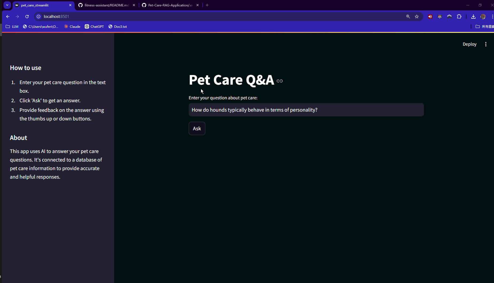

# Pet-Care-RAG-Application

# Pet Care Q&A

This project is a Pet Care Q&A system that uses AI to answer questions about pet care. It consists of a Flask backend, a Streamlit frontend, and uses PostgreSQL for data storage and Grafana for visualization.

## Features

- AI-powered answers to pet care questions
- User feedback system
- Data visualization with Grafana

## Prerequisites

- Docker and Docker Compose
- OpenAI API Key

## Installation

1. Clone the repository:

   ```
   git clone <repository-url>
   
   ```
2. Set up environment variables:
   Create a `.env` file in the root directory and add the following:

   ```
   OPENAI_API_KEY=your_openai_api_key
   POSTGRES_DB=pet_care
   POSTGRES_USER=POSTGRES_USER
   POSTGRES_PASSWORD=POSTGRES_PASSWORD
   GRAFANA_ADMIN_PASSWORD=admin
   ```
3. Build and start the services:

   ```
   docker-compose up --build
   ```

## Usage

1. Access the Streamlit interface at `http://localhost:8501`
2. Enter your pet care question in the text box and click "Ask"
3. View the AI-generated answer and provide feedback if desired
4. Access Grafana dashboards at `http://localhost:3000` (default credentials: admin/admin)


## File Structure

```
pet-care-qa/
│
├── Dockerfile
├── docker-compose.yaml
├── pet_care_streamlit.py
├── wait-for-postgres.sh
├── db_init.py
├── Pipfile
├── Pipfile.lock
├── README.md
│
├── data/
│   └── update_category.csv
│
└── Pet_care_app/
    ├── app.py
    ├── rag.py
    └── db.py
```

## Problem Description

This RAG LLM system could address:

Pet care and behavior advice
Adoption guidance
Breed-specific information
Health and wellness tips
Behavior interpretation
Pet safety strategies
Multi-pet household management
Senior pet care
Stress management for pets
Specific pet type care (e.g., military dogs, pit bulls)

It would serve as a comprehensive resource for pet owners, adopters, and animal care professionals.

## Dataset

The dataset is founded from Kaggle

https://www.kaggle.com/datasets/bishnushahi/dog-cat-qa

It is well structed  QA dataset ,and suitable for a noob like me to practice what I learned from this course.

## Project Overview

this RAG (Retrieval-Augmented Generation) application would be valuable in the broader field of pet care, specifically for both dogs and cats

## Running it

We use pipenv for managing dependencies and Python 3.11.

Make sure you have pipenv installed:

it contains 583 data  rows and 2 columns ,one is 'Question' and the other is 'Answer'

```bash
ip install pipenv
```

## Troubleshooting

If you encounter issues connecting to the Streamlit interface:

1. Check if all services are running:

   ```
   docker-compose ps
   ```
2. View logs for the app service:

   ```
   docker-compose logs app
   ```
3. Ensure ports are correctly mapped in `docker-compose.yaml`
4. Verify Streamlit is installed in the Dockerfile
5. Check the command in `docker-compose.yaml` starts Streamlit correctly

For more detailed troubleshooting steps, refer to the project documentation or open an issue on the project repository.

## Contributing

Contributions are welcome! Please feel free to submit a Pull Request.

## License

This project is licensed under the MIT License.
