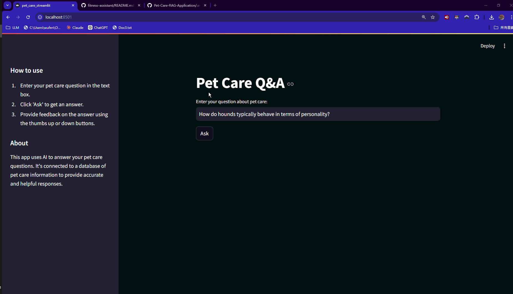
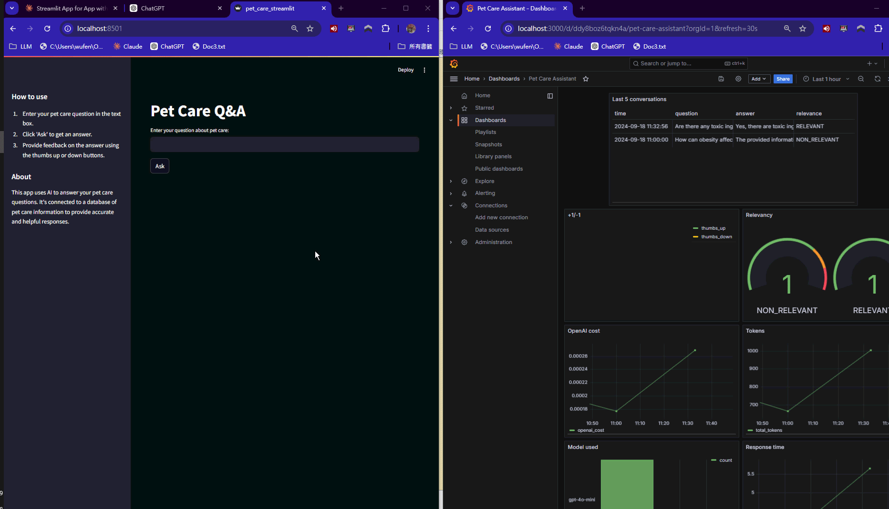

# Pet Care RAG Application

## Problem Description

This Retrieval-Augmented Generation (RAG) Large Language Model (LLM) system addresses a wide range of pet care needs, focusing on both dogs and cats. It serves as a comprehensive resource for:

- Pet care and behavior advice
- Adoption guidance
- Breed-specific information
- Health and wellness tips
- Behavior interpretation
- Pet safety strategies
- Multi-pet household management
- Senior pet care
- Stress management for pets
- Specific pet type care (e.g., military dogs, pit bulls)

This system aims to assist pet owners, potential adopters, and animal care professionals by providing AI-powered answers to their pet-related questions.

## Features

- AI-powered answers to pet care questions
- User feedback system
- Data visualization with Grafana
- Containerized application for easy deployment

## Usage

1. Access the Streamlit interface at `http://localhost:8501`
2. Enter your pet care question in the text box and click "Ask"
3. View the AI-generated answer and provide feedback if desired
4. Access Grafana dashboards at `http://localhost:3000` (default credentials: admin/admin)
   

## RAG Flow

Our system implements a full RAG flow:

1. **Knowledge Base**: We use a CSV file (`updated_category.csv`) as our knowledge base, which contains pet care Q&A data.
2. **Retrieval**: We use Minsearch for efficient retrieval of relevant information from the knowledge base.
3. **LLM**: We utilize OpenAI's GPT model to generate responses based on the retrieved information.

## Retrieval Evaluation

We evaluated multiple retrieval approaches:

1. We generated a ground truth retrieval dataset using OpenAI (`ground-truth-retrieval.csv`).
2. We used Minsearch to index our knowledge base and performed retrieval evaluations.
3. We optimized retrieval parameters, achieving:
   - Hit Rate: 0.9080617495711836
   - Mean Reciprocal Rank (MRR): 0.7256326063873232

The optimal weights found were:

- Question: 0.9367319821980193
- Answer: 2.1628814828290253
- Category: 0.7538333333333332

## RAG Evaluation

We performed a comprehensive RAG evaluation:

- Relevance scores:
  - RELEVANT: 0.925
  - PARTLY_RELEVANT: 0.065
  - NON_RELEVANT: 0.010

These results demonstrate the high quality of our RAG system's outputs.

## Interface

We provide two interfaces for interacting with our application:

1. **Streamlit UI**: A user-friendly web interface for asking questions and receiving answers.
2. **Grafana GUI**: A graphic interface for easy viewing our  RAG data .

## Ingestion Pipeline

We have a semi-automated ingestion pipeline:

1. `data_preprocessing.ipynb`: Adds a new column to categorize data as dog-related ('D'), cat-related ('C'), or both ('B').
2. `preprocessing.ipynb`: Converts categories to sets ({'Dog'}, {'Cat'}, {'Dog', 'Cat'}).

## Monitoring

Our monitoring solution includes:

1. User feedback collection through the Streamlit interface.
2. Grafana dashboard with at least 6 charts for visualizing system performance and user interactions.

## Containerization

The entire application is containerized using Docker Compose, including:

- Main application (Flask + Streamlit)
- PostgreSQL database
- Grafana for monitoring

## Reproducibility

To run the project:

1. Clone the repository:

   ```
   git clone git@github.com:wufengyou/Pet-Care-RAG-Application.git
   ```
2. Set up environment variables in a `.env` file:

   ```
   OPENAI_API_KEY=your_openai_api_key
   POSTGRES_DB=pet_care
   POSTGRES_USER=POSTGRES_USER
   POSTGRES_PASSWORD=POSTGRES_PASSWORD
   GRAFANA_ADMIN_PASSWORD=admin
   ```
3. Build and start the services:

   ```
   docker-compose up --build
   ```
4. Access the Streamlit interface at `http://localhost:8501`
5. Access Grafana dashboards at `http://localhost:3000` (default credentials: admin/admin)

## Best Practices

- Hybrid search: We use Minsearch, which combines text and vector search capabilities.

## Dataset

We use a well-structured Q&A dataset from Kaggle, focusing on dog and cat care:
https://www.kaggle.com/datasets/bishnushahi/dog-cat-qa

The dataset contains 583 rows with 'Question' and 'Answer' columns, providing a solid foundation for our pet care RAG system.

## File Structure

```
pet-care-qa/
│
├── Dockerfile
├── docker-compose.yaml
├── pet_care_streamlit.py
├── wait-for-postgres.sh
├── db_init.py
├── Pipfile
├── Pipfile.lock
├── README.md
│
├── data/
│   └── update_category.csv
│
├── Pet_care_app/
│   ├── app.py
│   ├── rag.py
│   └── db.py
│
└── grafana/
    ├── init.py
    └── dashboard.json
```

## Setting up Grafana

1. Ensure Grafana is running (starts automatically with `docker-compose up`).
2. Initialize the dashboard:

   ```
   pipenv shell
   cd grafana
   python init.py
   ```
3. Go to [localhost:3000](http://localhost:3000/) and log in with:

   - Username: admin
   - Password: admin (change when prompted)

   When prompted, keep "admin" as the new password.

   

## Troubleshooting

If you encounter issues:

1. Check if all services are running: `docker-compose ps`
2. View logs for the app service: `docker-compose logs app`
3. Ensure ports are correctly mapped in `docker-compose.yaml`
4. Verify Streamlit is installed in the Dockerfile
5. Check the command in `docker-compose.yaml` starts Streamlit correctly

For more detailed troubleshooting, please open an issue on the project repository.
